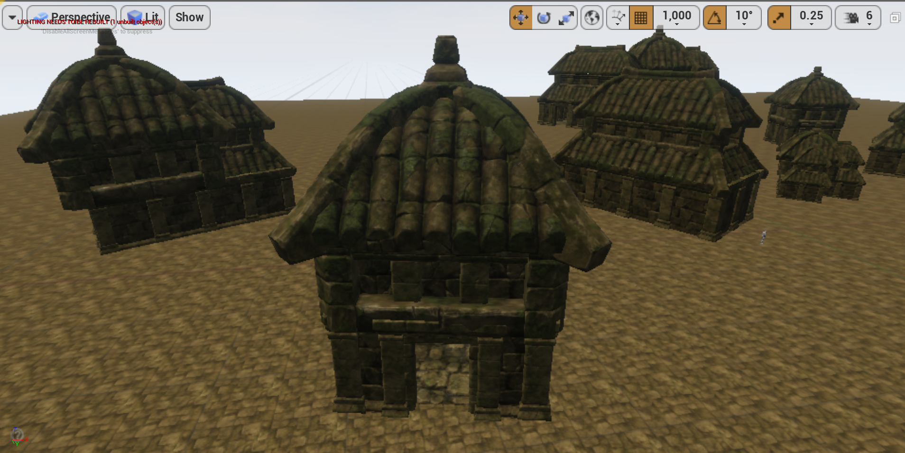
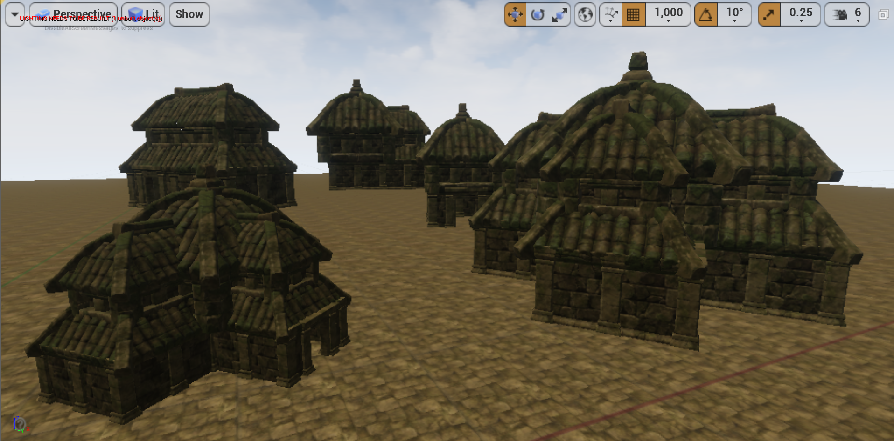
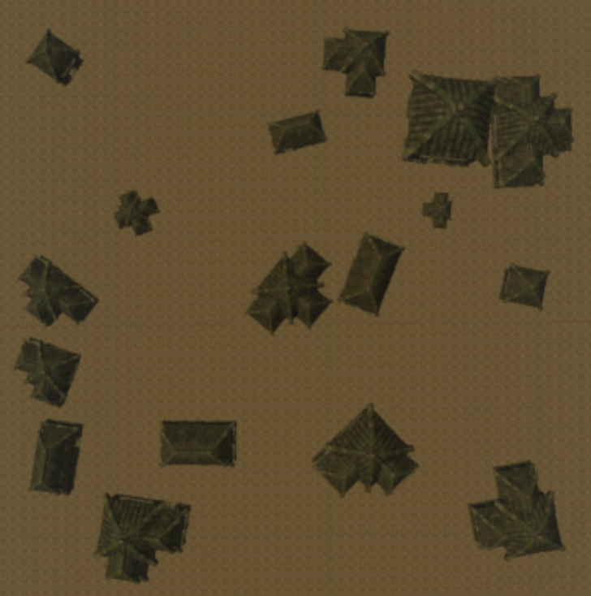
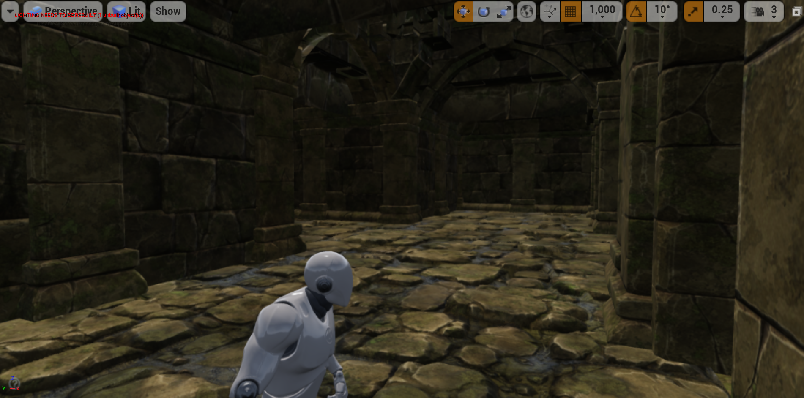

# Procedural City Spawner

Generates a city using [Eternal Temple](https://www.unrealengine.com/marketplace/eternal-temple) assets. Made entirely using Unreal Engine’s C++ API.  

For source files, see Source/ModularTown/ModularBuilding, GrammarShape, CitySpawner, and SimplexNoise.  

## Grammar Design
Starts off by creating a foundation for the building. Can either be a standalone room, or divide into a central room with 1-4 adjacent rooms. Rooms keep track of where the adjacent room is or how many adjacent rooms there are if it is the central room.  

Each room then generates a wall and a column at the right edge of the wall for continuity. The transform is generated for each wall where there is no adjacent room. There is a random 1/4 chance that the wall is an entrance.  

Finally, the room generates a roof with the transform adjusted based on adjacent rooms. The central room has a special type of roof unless there is only one adjacent room.  

## City Generation
The city uses a 2D Simplex noise function to represent common areas where people walk around. With that knowledge, buildings are placed in high, but not too high density areas (where people walk around but not in the middle of where everybody is walking around). The noise function is sampled at uniform points on a grid, where it is then checked to see if it lies in the threshold. If so, a building is spawned with its scale proportional to the value of the noise function and a random up-axis rotation applied.  

In the future, I may add paths using the same noise function to mark where the player and AI should move. Buildings could also be more complex with additional grammar rules such as bridges between buildings or large temples with multiple interior floors. I made sure to program all transformations relative to a grid size (600 for this pack). The meshes can easily be replaced with any modular mesh components for walls, entrances, etc to create a variety of styles. Lastly, I plan to integrate the city generation with my existing game project, which would add height variation, dynamic terrain textures, and procedural foliage.  

